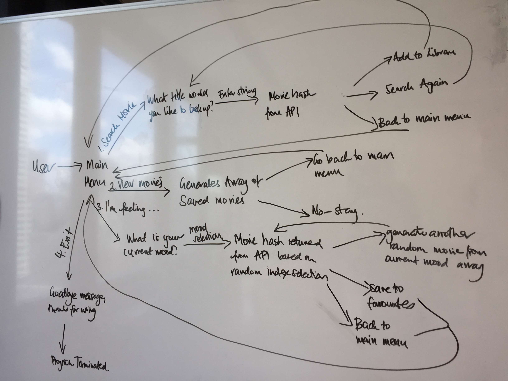

# Terminal App - myMDb

### GitHub
[James' GitHub Repository](https://github.com/jmerrigan/terminalapp)

### Purpose
The purpose of myMDB is to provide users with movie suggestions and a personalised database to find a movie to watch.

 provides a personal movie database which can search and save movies to a watchlist. It can also suggest movies based on mood and genre.

#### Functionality
Based on user inputs, myMDb will return a movie suggestion or display saved movies favourited by the user.

The movie suggestions are based on current mood which in turn links to a list of movies by genre.

myMDb allows users to search via a specific movie title, which will return movie details (title, genre, director, plot) for the user to view.

### Dependencies
The Ruby gems 'tty-font', 'tty-spinner' and 'json' are required to run myMDb.

myMDb provides movie data from the OMDb API (key required): http://www.omdbapi.com

### Instructions for Use

1. Open Terminal

2. Set your API Key environment variable by entering:
    ```
    $ export OMDB_API_KEY='your_key'
    ```

3. Then enter the below command while PWD is the        app folder
    ```
    $ ruby main.rb
    ```
4. From the main menu, make a selection.


## Designing and Planning
### Brainstorming
Paper was used for initial freeform brainstorming and scope definition.


### Task Management
Trello allowed us to define the features, flow and logic for a minimum viable product, breakdown and itemise current tasks to be performed and scope out future enhancements or challenges to overcome, in a much more organised and systematic manner.


### User Journey/Workflow


### Project Plan & Timeline
The scope for myMDb's initial build was two days.

Day 1 tasks and time were largely spent on finding suitable Ruby gems and an API for movie data, defining the main workflow, functionality and features, logic for methods on paper and in Trello, and getting a functional base code.

Day 2 tasks and time were largely spent on adding movie randomiser function, cleaning up and enhancing the user interface, testing user scenarios, closing any in-app loop gaps, writing documentation and refactoring code into modules.

### Challenges
* Scaling back features to the minimum to plot out iterative future enhancements.
* No inbuilt database to store values outside of a single user session or store movie titles for randomiser.
* Finding an API for movie data retrieval.
* Testing out movie titles stored in randomiser due to exact/near exact search parameters required by API.

        ==========================================================
                                             |
                                  ___________I____________
                                 ( _____________________  )
                               _.-||                    ||
                           _.-'   ||                    ||
          ______       _.-'       ||                    ||
         |      |_ _.-'           ||                    ||
         |      |_|_              ||        fin         ||
         |______|   `-._          ||                    ||
            /|          `-._      ||                    ||
           / |              `-._  ||                    ||
          /  |                  `-||____________________||
         /   |                    ------------------------
        /____|_______________________|________________|______
        
        Thanks for using myMDB!
        =========================================================